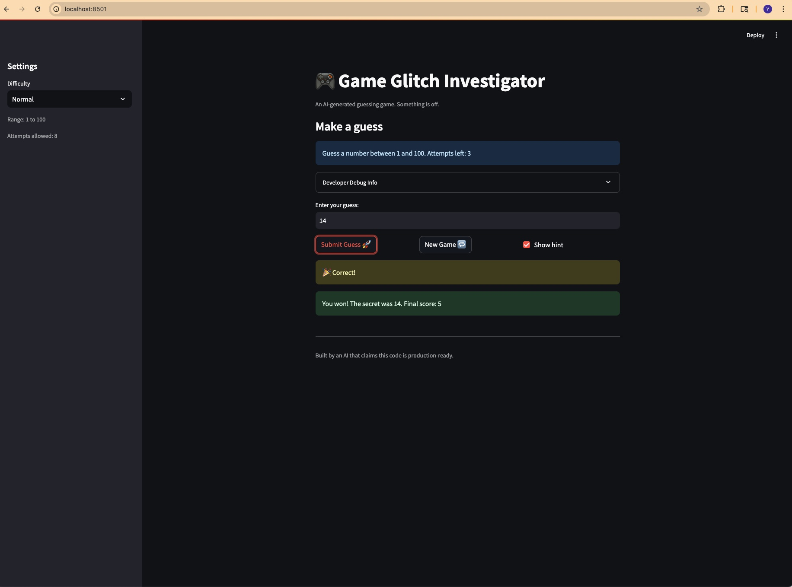
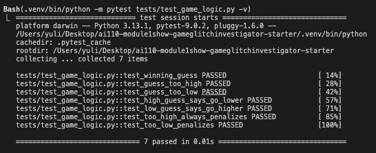

# 🎮 Game Glitch Investigator: The Impossible Guesser

## 🚨 The Situation

You asked an AI to build a simple "Number Guessing Game" using Streamlit.
It wrote the code, ran away, and now the game is unplayable. 

- You can't win.
- The hints lie to you.
- The secret number seems to have commitment issues.

## 🛠️ Setup

1. Install dependencies: `pip install -r requirements.txt`
2. Run the broken app: `python -m streamlit run app.py`

## 🕵️‍♂️ Your Mission

1. **Play the game.** Open the "Developer Debug Info" tab in the app to see the secret number. Try to win.
2. **Find the State Bug.** Why does the secret number change every time you click "Submit"? Ask ChatGPT: *"How do I keep a variable from resetting in Streamlit when I click a button?"*
3. **Fix the Logic.** The hints ("Higher/Lower") are wrong. Fix them.
4. **Refactor & Test.** - Move the logic into `logic_utils.py`.
   - Run `pytest` in your terminal.
   - Keep fixing until all tests pass!

## 📝 Document Your Experience

- [x] Describe the game's purpose.
- [x] Detail which bugs you found.
- [x] Explain what fixes you applied.

**Game's purpose:** A number guessing game built with Streamlit where the player tries to guess a secret number within a limited number of attempts, receiving "Go HIGHER" or "Go LOWER" hints after each guess.

**Bugs found:**
  1. **Reversed hints** — "Go HIGHER" showed when the guess was too high and "Go LOWER" when too low, sending the player in the wrong direction.
  2. **String comparison fallback** — On certain attempts, the secret was cast to a string, causing lexicographic comparison (e.g., `"9" > "100"` is `True`), which produced incorrect outcomes.
  3. **New Game didn't reset** — Clicking "New Game" after winning or losing didn't reset the game status, score, or history, leaving the player stuck.
  4. **Inconsistent scoring** — "Too High" guesses rewarded +5 points on even attempts instead of always penalizing.
  5. **Hardcoded range** — The info message always said "between 1 and 100" regardless of difficulty.
  6. **Invalid guesses burned attempts** — Submitting empty or non-numeric input still counted as an attempt.

**Fixes applied:**
  1. Swapped the hint messages in `check_guess()` so "Go LOWER" appears for too-high guesses and "Go HIGHER" for too-low.
  2. Removed the `TypeError` fallback that cast guesses to strings — all comparisons are now integer-based.
  3. Added `score = 0`, `history = []`, and `status = "playing"` resets to the New Game handler.
  4. Simplified `update_score()` to always deduct 5 points for "Too High" wrong guesses.
  5. Changed the info message to use the actual `low` and `high` values from the difficulty setting.
  6. Moved the attempt counter increment so it only fires after a valid guess is parsed.
  7. Refactored all game logic from `app.py` into `logic_utils.py` for cleaner separation of concerns.

## 📸 Demo

## 🧪 Pytest Results

## 🚀 Stretch Features

- [ ] [If you choose to complete Challenge 4, insert a screenshot of your Enhanced Game UI here]
